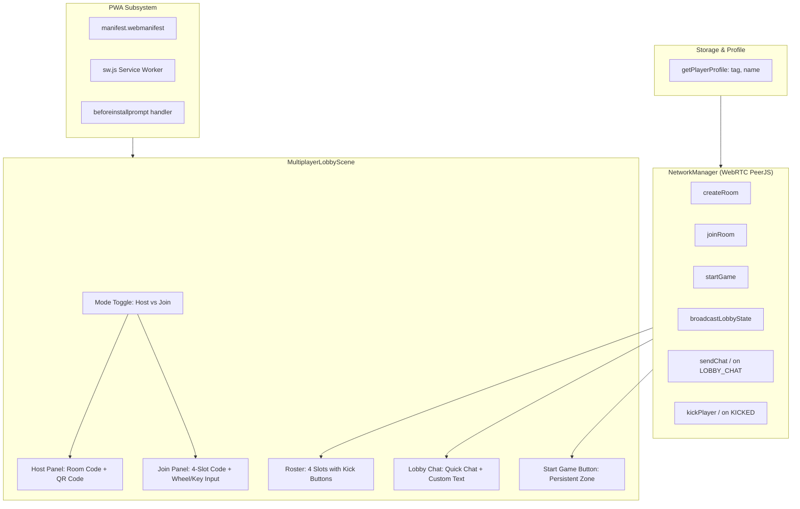

# Feature Spec: Multiplayer Lobby Polish, Host Controls & PWA Installation

## 1. Problem Statement
The v1.4.0 multi-device real-time multiplayer system successfully delivers WebRTC DataChannels P2P gameplay, but user testing surfaced several usability friction points, functional bugs, and missing features:
1. **Join Room Code Input**: Entering the 4-character room code on desktop or mobile currently only supports clicking/tapping small `▲` / `▼` chevrons, which is slow and frustrating. Players need direct keyboard input (PC and mobile) and mouse wheel scrolling over slots.
2. **Missing QR Code**: The host screen explicitly states "Scan QR Code with phone to join instantly!", but no QR code appears because the script URL in `index.html` failed to load from CDN.
3. **Application Title**: The browser tab title still displays legacy text "Birthday Tanks! — Allan's 70th Birthday" instead of the multi-game collection title "Classic Arcade".
4. **PWA Mobile WebApp Installation**: Visiting the game on mobile smartphones does not offer the native browser "Install as an app" / Add to Home Screen prompt.
5. **Create Room vs Join Room Toggle Glitch**: When a player is on the Join Game screen and clicks "👑 CREATE ROOM", the toggle button highlights Create Room, but the screen continues displaying Join Game because `network.disconnect()` emits `host-disconnected`, which triggers an event handler that forces `showJoinPanel()`.
6. **Multiplayer Start Game Button Unresponsive**: When 2 players enter the lobby, clicking "START GAME" does nothing because `updateStartButtonVisuals()` destructively removes all children of the container (`removeAll(true)`), destroying the interactive `Zone` and its click handler.
7. **Host Identity Hardcoded to Allan**: The host name always displays "Allan" even if the player customized their tag and name on the High Score screen, because `NetworkManager` looks for `profile.fullName` while `Storage.getPlayerProfile()` returns `{ tag, name }`.
8. **No Lobby Chat**: Players in the lobby cannot communicate before the match starts.
9. **No Host Kick Control**: The room host cannot remove unwanted players or phantom connections from the lobby.

---

## 2. Acceptance Criteria

### AC-1: Join Room Code Keyboard & Mouse Wheel Input
- On PC: Pressing alphanumeric keys (`A-Z`, `0-9`) automatically enters the character into the active slot and advances cursor to the next slot (`0 -> 1 -> 2 -> 3`).
- Pressing `Backspace` deletes the current/previous character and moves cursor back.
- Pressing `ArrowLeft` / `ArrowRight` navigates between the 4 slots.
- Pressing `ArrowUp` / `ArrowDown` cycles the alphabet on the active slot.
- Pressing `Enter` automatically attempts to join the room.
- Mouse wheel scrolling (`wheel` event) while hovering over any slot cycles the slot's character up or down.
- On mobile: A visible "⌨️ TYPE CODE" button or tapping any slot provides direct keyboard input (via focused input or prompt) so mobile users can type or paste room codes effortlessly.

### AC-2: Host Screen QR Code Rendering
- Host screen displays a high-contrast 120x120 QR Code encoding `${location.origin}${location.pathname}?room=${roomCode}`.
- QR Code library is reliably vendored or loaded without external CDN failure.
- Scanning the QR code on a mobile device immediately opens the URL with `?room=XXXX` and auto-joins the lobby.

### AC-3: Title & Metadata Synchronization
- Browser `<title>` updated to `Classic Arcade`.
- Web app manifest and HTML meta tags declare `Classic Arcade`.
- Consistency across `index.html`, `package.json`, and UI headers.

### AC-4: Mobile PWA "Install as App" WebApp Integration
- Web app manifest (`manifest.webmanifest`) specifies standalone display, theme color (`#1a1a24`), background color (`#0f0f14`), and application icons.
- Service worker (`sw.js`) registered to enable PWA installability criteria and offline caching of core assets.
- Captures browser `beforeinstallprompt` event and presents an install prompt/button on the Splash screen for mobile visitors.
- Includes iOS meta tags for full-screen web app mode (`apple-mobile-web-app-capable`).

### AC-5: Create Room vs Join Room Mode Switching Fix
- Switching between "👑 CREATE ROOM" and "📱 JOIN ROOM" cleanly transitions containers without race conditions.
- Disconnecting previous connections during mode switch checks `this.currentMode === 'join'` before calling `showJoinPanel()`, preventing loopback glitches.
- Host panel UI elements are created synchronously and render immediately.

### AC-6: Start Game Button Reliability
- `updateStartButtonVisuals()` does NOT destroy the interactive click zone.
- When >= 2 players are present, clicking the start button triggers `network.startGame()` and starts the selected game mode (`MultiplayerTanks` or `MultiplayerPong`) across all connected devices.
- Audio cues provide immediate feedback on press.

### AC-7: Host Player Identity from High Score Profile
- Host slot 1 uses `storage.getPlayerProfile()` extracting `name || fullName` and `tag`.
- If a custom player profile exists (e.g. tag `COD`, name `Cody`), host displays `[COD] Cody`.
- Defaults to `[ALL] Allan` only if no profile has been saved.

### AC-8: Live Lobby Chat Box
- Bi-directional WebRTC packet `LOBBY_CHAT` supported in `NetworkManager.js`.
- Renders a clean chat panel in `MultiplayerLobbyScene` displaying the last 4 chat messages with sender badge and timestamp.
- Quick-chat action bubbles for fast mobile tapping (`👋 Hello!`, `👍 Ready!`, `🔥 Let's play!`, `🕹️ Change game!`).
- Custom message input option (max 50 characters, sanitized against profanity).

### AC-9: Host Kick Player Ability
- Host can remove client players (slots 2, 3, 4) from the lobby.
- Each client player row in the host's view provides a visible red `✕` kick button, along with support for right-click on desktop and long-press (500ms) on mobile.
- Host triggers `network.kickPlayer(slot)`, which dispatches a `KICKED` packet to the client and terminates the connection.
- Kicked client receives a graceful notification and is returned to the Join screen.

---

## 3. Architecture & Data Flow

---

## 4. Testing Strategy
1. **Node Unit Tests**:
   - `tests/multiplayer.test.js` updated to verify `LOBBY_CHAT` packet handling, `kickPlayer` authorization and state cleanup, host profile name extraction, and room code wheel/keyboard input sanitization.
2. **Playwright Dual-Browser E2E**:
   - Test Host and Client joining room via code.
   - Test Host kicking Client (verifying client receives notification and slot is freed).
   - Test Chat message transmission between Host and Client.
   - Test Host starting game with persistent button click.
3. **PWA Manifest & Service Worker Verification**:
   - Check `manifest.webmanifest` syntax and icons.
   - Verify Service Worker registers without error.

---

## Domain Decisions

### [multiplayer][2026-09-23][main]
- **Vendored QR Code**: Local bundle `vendor/qrcode.min.js` replaces CDN dependency to ensure offline reliability and avoid CSP/MIME issues.
- **Client Disconnect Event Decoupling**: Guard `host-disconnected` handler with `wasKicked` state to prevent connection close race conditions from clobbering host kick status notifications.
- **Star Topology Chat & Profanity Sanitization**: Bidirectional WebRTC `LOBBY_CHAT` packets sanitized both on client submission and host broadcast using `ProfanityFilter.censorText()`.
- **Roster Kick Button Depth & Geometry**: Partition row interaction width to preserve a clear 46px margin for the red `✕` kick button container (`depth: 10`, 32x32 hit zone) preventing zone shadowing.

